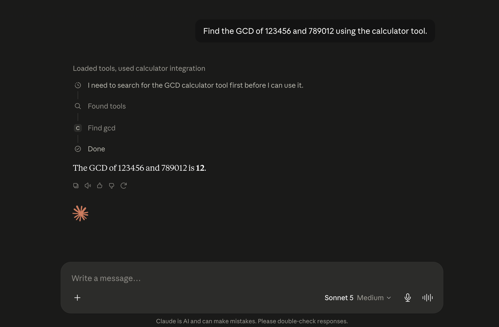

# Calculator MCP
[](https://github.com/rudhrmehra/calculator-mcp/releases)
[](https://www.python.org/)
[](https://github.com/jlowin/fastmcp)
[](LICENSE)


A **Model Context Protocol (MCP)** server built with **Python** and **FastMCP** that exposes mathematical operations as AI tools. Compatible with MCP clients such as **Claude Desktop**, enabling AI assistants to perform reliable mathematical computations through external tool execution.

---
## Project Demo



---
## Features

- ➕ Addition
- ➖ Subtraction
- ✖️ Multiplication
- ➗ Division
- 🔢 Power / Exponentiation
- √ Square Root
- ❗ Factorial
- 📐 Greatest Common Divisor (GCD)
- 📏 Least Common Multiple (LCM)
- 🔍 Prime Number Detection
- % Modulus

---

## Technologies Used

- Python 3.11+
- FastMCP
- Model Context Protocol (MCP)
- Claude Desktop (MCP Client)
- Python `math` module

---

## Project Structure

```text
calculator-mcp/
│
├── server.py          # MCP server and calculator tools
├── requirements.txt   # Python dependencies
├── README.md
└── .gitignore
```

---

## Installation

### 1. Clone the repository

```bash
git clone https://github.com/rudhrmehra/calculator-mcp.git
cd calculator-mcp
```

### 2. Create a virtual environment

```bash
python3 -m venv .venv
```

### 3. Activate the virtual environment

**macOS / Linux**

```bash
source .venv/bin/activate
```

**Windows**

```powershell
.venv\Scripts\activate
```

### 4. Install dependencies

```bash
pip install -r requirements.txt
```

---

## Running the MCP Server

Start the server using:

```bash
python server.py
```

The server communicates over the stdio transport, allowing MCP clients such as Claude Desktop to discover and invoke calculator tools automatically.

---

## Claude Desktop Configuration

Add the following entry to your Claude Desktop MCP configuration.

```json
{
  "mcpServers": {
    "calculator": {
      "command": "/absolute/path/to/.venv/bin/python",
      "args": [
        "server.py"
      ],
      "cwd": "/absolute/path/to/calculator-mcp"
    }
  }
}
```

Restart Claude Desktop after saving the configuration. The Calculator MCP server will be discovered automatically.
---

## Available Tools

| Tool | Description |
|------|-------------|
| `add` | Add two numbers |
| `subtract` | Subtract two numbers |
| `multiply` | Multiply two numbers |
| `divide` | Divide two numbers |
| `power` | Raise a number to a power |
| `square_root` | Calculate square root |
| `factorial` | Calculate factorial |
| `is_prime` | Check if a number is prime |
| `find_gcd` | Find the greatest common divisor |
| `find_lcm` | Find the least common multiple |
| `modulus` | Calculate remainder |

---

## Example Usage

**Prompt**

```text
Find the GCD of 123456 and 789012.
```

**Claude Desktop**

```text
Loaded tools, used calculator integration.
```

**Response**

```text
The greatest common divisor of 123456 and 789012 is 12.
```

---

## Error Handling

The server validates invalid mathematical operations and raises descriptive exceptions.

Examples include:

- Division by zero
- Modulus by zero
- Square root of a negative number
- Factorial of a negative integer

---

## License

This project is licensed under the MIT License.

---

## Author

**Rudhr Mehra**

GitHub: @rudhrmehra
